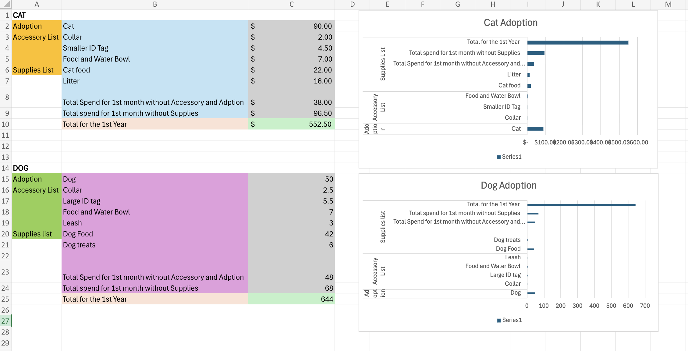

# Adoption Problem Solving Assignment

## Skills Used
- Excel Formulas
- Data Analysis
- Chart Creation
- Financial Calculations
- Data Organization
- Problem Solving

## Project Description
This Excel assignment analyzes cat and dog adoption-related expenses using formulas, categorized calculations, yearly estimations, and chart visualization techniques.

## Project Preview

## Key Features
- Monthly and yearly expense calculations
- Cat vs Dog adoption comparison
- Organized accessory and supplies categorization
- Visual chart representation
- Structured financial estimation

## Excel File
[Download Excel Assignment](Adoption Problem Solving Assignment.xlsx)