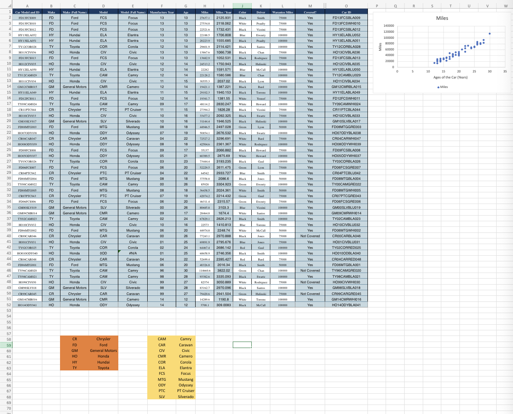
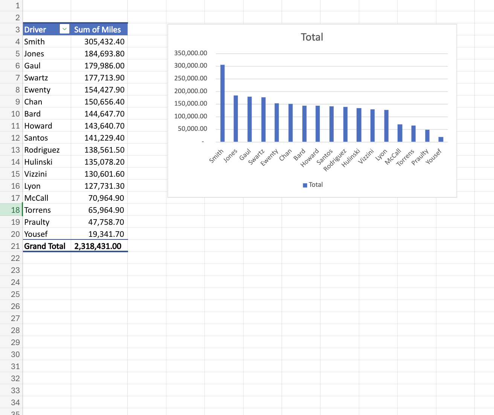

# Car Inventory Assignment

## Skills Used
- Excel Formulas
- Data Analysis
- Pivot Tables
- Scatter Charts
- Data Visualization
- Sorting and Filtering
- Conditional Logic
- Vehicle Data Analysis

## Project Description
This Excel project analyzes vehicle inventory records using structured datasets, formulas, chart visualization, pivot table analysis, and yearly mileage calculations.

The assignment focuses on organizing automotive inventory information while evaluating vehicle age, mileage trends, warranty coverage, and driver-based mileage analysis.

---

# Main Inventory Dataset

### Features Included
- Car make and model categorization
- Vehicle age calculations
- Miles per year calculations
- Warranty coverage determination
- Driver assignment tracking
- Warranty mileage comparison
- Scatter chart visualization for mileage trends

---

# Pivot Table and Chart Analysis

### Pivot Table Insights
- Total mileage grouped by driver
- Driver-based mileage comparison
- Visual bar chart representation
- Grand total mileage calculations
- Data summarization techniques

---

# Key Excel Techniques Used
- IF formulas
- Structured data tables
- Sorting and filtering
- Pivot table analysis
- Scatter chart creation
- Conditional calculations
- Data categorization

