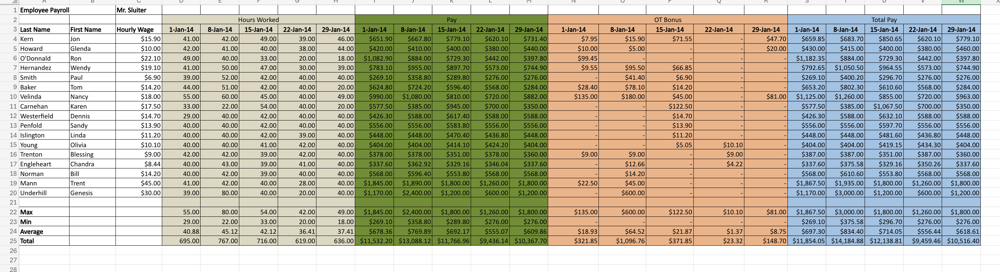

# Employee Payroll Assignment

## Skills Used
- Excel Formulas
- Payroll Calculations
- Financial Analysis
- Data Organization
- Conditional Logic
- Statistical Analysis
- Spreadsheet Formatting
- Workforce Data Management

## Project Description
This Excel payroll project analyzes employee working hours, overtime payments, regular pay, and total payroll compensation using structured formulas and organized financial datasets.

The assignment focuses on payroll processing techniques, overtime calculations, wage analysis, and workforce compensation management through Excel-based automation and structured spreadsheet design.

---

# Project Preview

---

# Key Features
- Employee payroll management
- Hourly wage calculations
- Weekly hours tracking
- Overtime bonus calculations
- Total compensation analysis
- Average, minimum, and maximum calculations
- Structured payroll dataset formatting
- Financial data organization

---

# Payroll Data Includes
- Employee names
- Hourly wages
- Hours worked
- Weekly pay
- Overtime bonus calculations
- Total pay summaries
- Statistical payroll summaries

---

# Excel Techniques Used
- Mathematical formulas
- Payroll calculations
- Financial summaries
- Cell formatting
- Organized spreadsheet structure
- Conditional calculations
- Data analysis techniques

---

# Statistical Analysis Included
- Maximum payroll values
- Minimum payroll values
- Average payroll calculations
- Total payroll summaries
- Overtime compensation tracking

