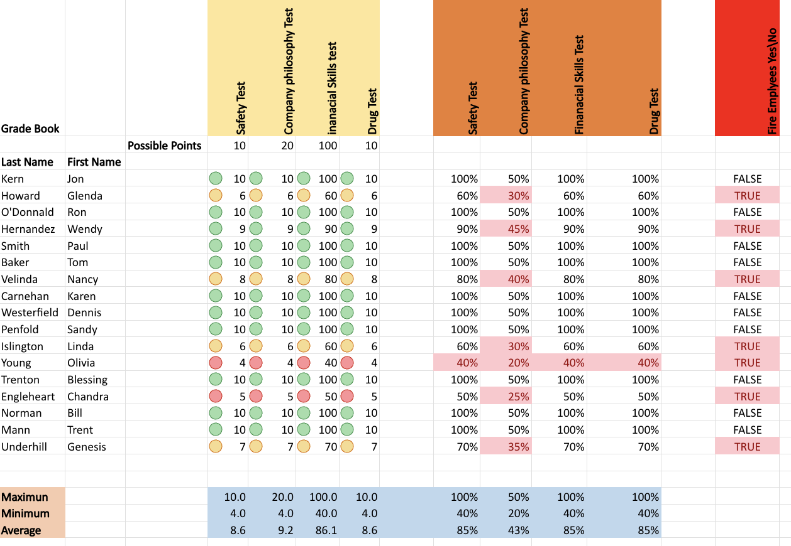
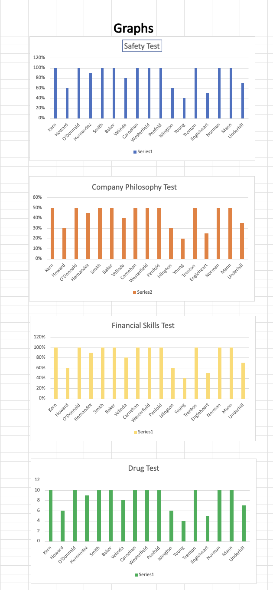

# Grade Book Assignment

## Skills Used
- Excel Formulas
- Data Analysis
- Conditional Logic
- Statistical Calculations
- Data Visualization
- Chart Creation
- Spreadsheet Formatting
- Performance Evaluation

## Project Description
This Excel project analyzes employee test performance using structured grade book calculations, percentage analysis, conditional evaluations, and chart visualization techniques.

The assignment focuses on performance tracking, statistical summaries, employee evaluation logic, and visual representation of test results using Excel.

---

# Grade Book Dataset

### Dataset Features
- Safety test scores
- Company philosophy test results
- Financial skills evaluation
- Drug test tracking
- Employee performance assessment
- Pass and fail determination
- Conditional employee firing logic

---

# Graph and Visualization Analysis

### Graph Features
- Safety test comparison chart
- Company philosophy performance chart
- Financial skills visualization
- Drug test performance graph
- Employee comparison analysis
- Percentage-based performance tracking

---

# Statistical Analysis Included
- Maximum score calculations
- Minimum score calculations
- Average score calculations
- Percentage analysis
- Employee evaluation summaries

---

# Key Excel Techniques Used
- IF formulas
- Conditional formatting
- Percentage calculations
- Data visualization
- Chart generation
- Organized datasets
- Performance tracking formulas
- Spreadsheet automation logic

