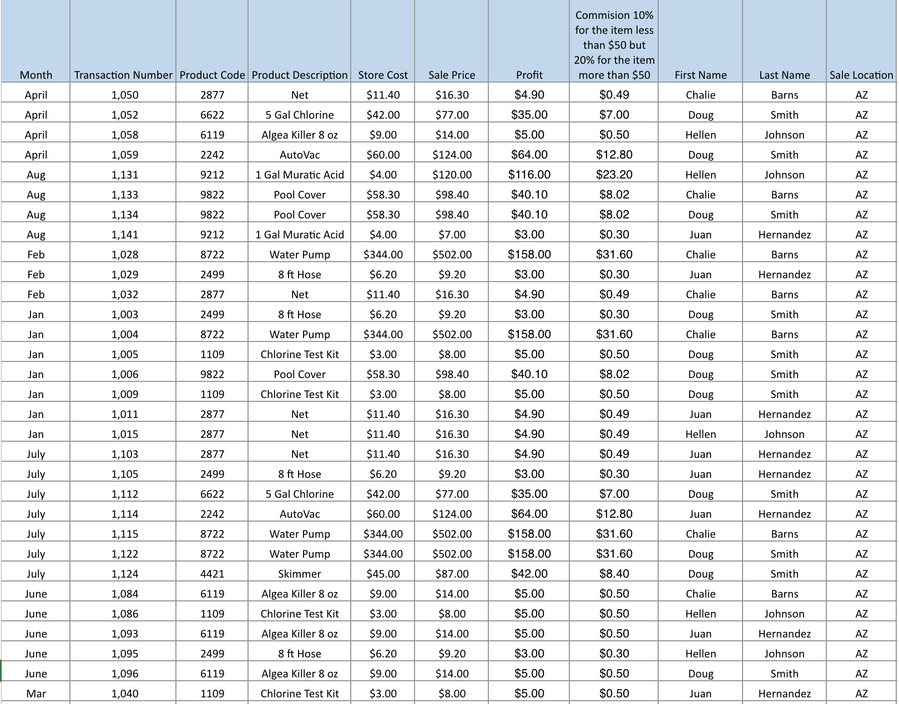
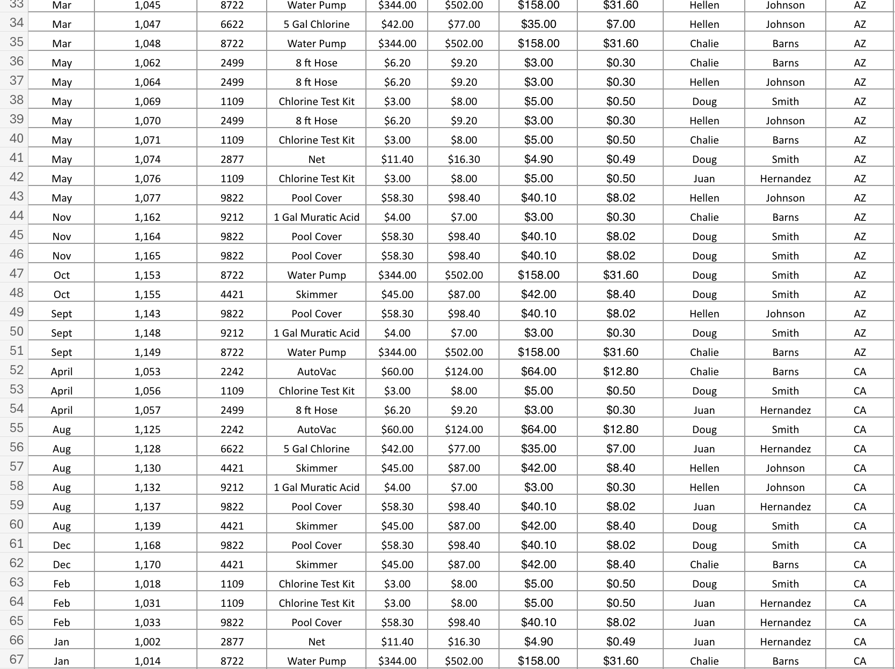
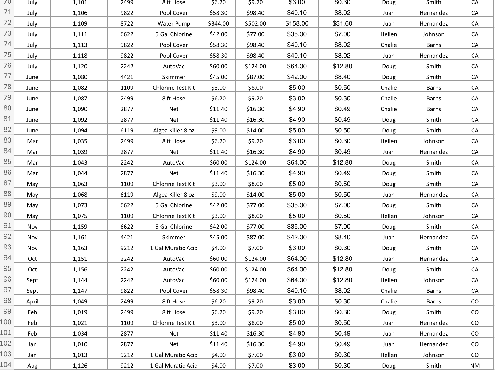
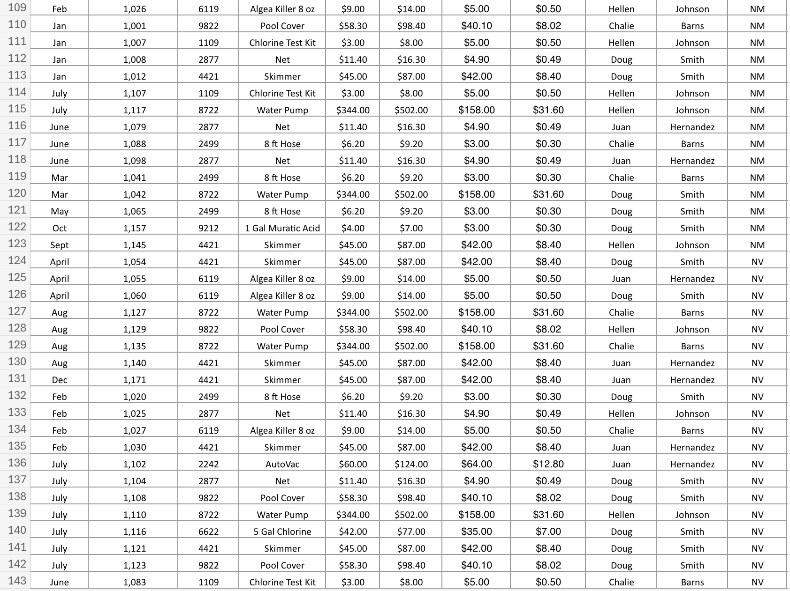
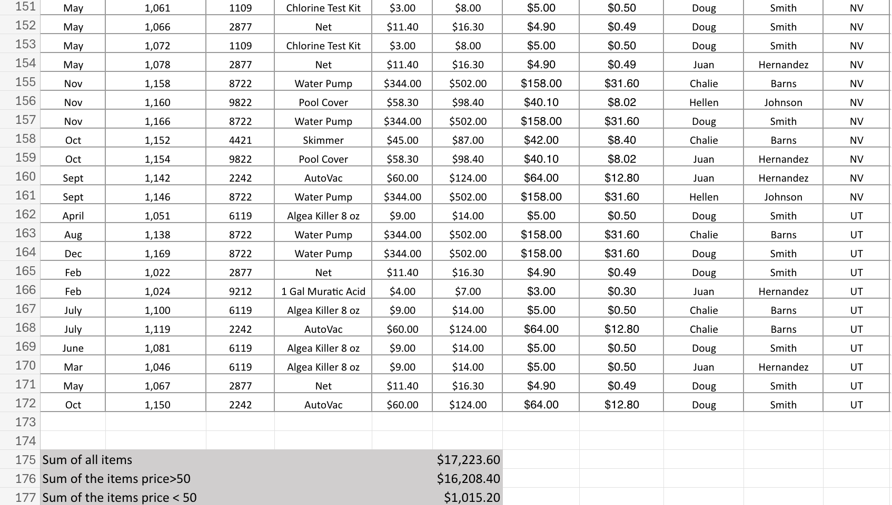
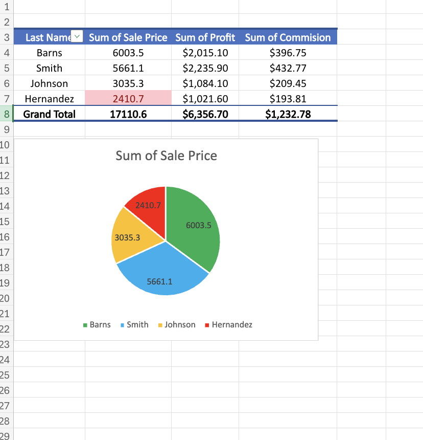

# Sales Report Assignment

## Skills Used
- Excel Formulas
- Sales Data Analysis
- Profit Calculation
- Commission Calculation
- Pivot Table Analysis
- Pie Chart Visualization
- Data Organization
- Financial Summary Reporting

## Project Description
This Excel project analyzes sales transaction data by product, month, salesperson, and sale location. The assignment uses structured calculations to determine store cost, sale price, profit, commission, and total sales performance.

The project also includes pivot table analysis and chart visualization to summarize sales performance by employee.

---

## Full Sales Dataset

This section shows the main transaction dataset, including product codes, product descriptions, store cost, sale price, profit, commission, employee names, and sale locations.

---

## Continued Sales Records

These screenshots show the full sales dataset across multiple locations and months, including AZ, CA, CO, NM, NV, and UT sales records.

---

## Sales Summary and Commission Totals

This section summarizes:
- Total value of all items
- Total value of items priced above $50
- Total value of items priced below $50

---

## Pivot Table and Chart Analysis

The pivot table summarizes sales performance by salesperson using:
- Sum of Sale Price
- Sum of Profit
- Sum of Commission

The pie chart visually compares total sale price contribution by employee.

---

## Key Features
- Product-level sales tracking
- Monthly transaction organization
- Profit and commission calculations
- Salesperson performance comparison
- Location-based sales records
- Pivot table summary
- Pie chart visualization
- Total sales and item-price category summaries

---

## Excel Techniques Used
- Basic arithmetic formulas
- Commission calculation logic
- Currency formatting
- Pivot tables
- Chart creation
- Sales data organization
- Financial reporting layout
- Data summarization

---

## Excel File
[Download Excel Assignment](Sales_Report_Assignment.xlsx)